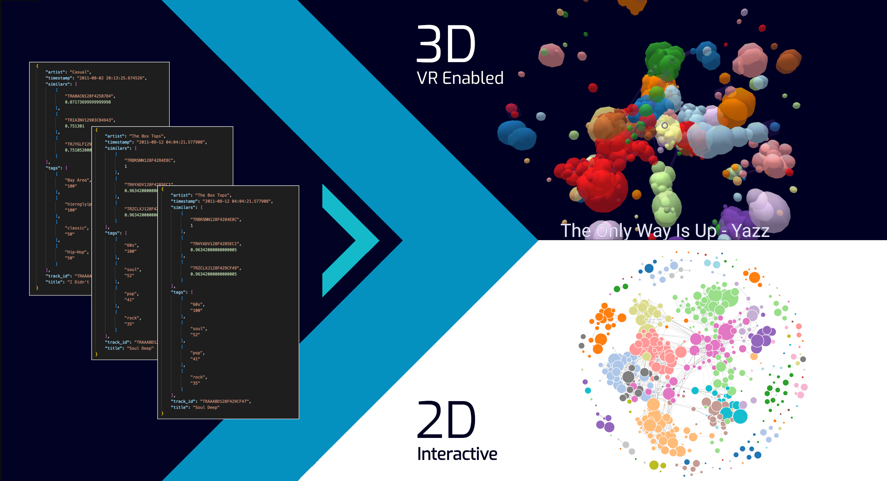

# LastFM_Interactive_Visualisations

### Submission for Assignment 2 - CA675 Cloud Technologies.

## Introduction

We developed two interactive visualisations using a sample from a dataset of similarites and tags of 850,000 songs. Each visualization is styled using the calculated graph properties of the underlying data.



## Data

We have obtained a dataset of 850,000 songs which were retireived from the LastFM API (not by us). Data came in following json format:

```
{
	"artist": "Adelitas Way",
	"timestamp": "2011-08-15 09:59:32.436152", 
	"similars": [
  ["TRZNRZF128F9318787", 1],
  ... ,
  ], 
  "tags": 
  [
	  ["alternative rock", "100"], 
  	["rock", "60"],
	  ... ,
  ], 
  "track_id": "TRAAAAK128F9318786",
  "title": "Scream”
}
```

## Graph Processing

We have used Spark GraphFrames to build a graph of songs using similarity ratings to build our edges. We performed PageRank and Community Detection algorithms and then reduce the number of nodes for visualisation purposes.

`Graph Processing` Folder contains scala and shell commands to perform data processing though spark shell (locally & AWS). 

## Visualizations

`2D Visualization` contatins source files for [2D Visualisaion](https://bl.ocks.org/DenisKealy/ff0ce2375003dcf9be72c3c91346aff7).
 - Live source files (powers the visualisation) => [Gist source](https://gist.github.com//DenisKealy/ff0ce2375003dcf9be72c3c91346aff7).


`VR Visualization` contains source files for [3D Visualisation](https://bl.ocks.org/doncesarts/e61aca51e0f5123a972377fd0b90e205).
 - Live source files (powers the visualisation) => [Gist source](https://gist.github.com/doncesarts/e61aca51e0f5123a972377fd0b90e205)
 
 ## Video Overview
 
 Link to video overview - https://www.youtube.com/watch?v=OPvFcXa06Y0
